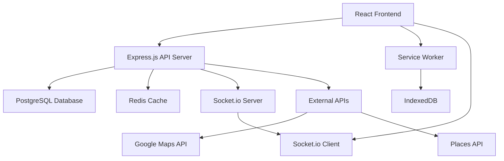

# Design Document

## Overview

The Wanderlog clone is a full-stack web application built with React frontend and Node.js backend. The system follows a RESTful API architecture with real-time collaboration features using WebSocket connections. The application supports offline functionality through service workers and local storage, with data synchronization when connectivity is restored.

## Architecture

### System Architecture



### Technology Stack

**Frontend:**
- React 18 with functional components and hooks
- React Router for navigation
- Context API for state management
- Material-UI or Tailwind CSS for styling
- Socket.io client for real-time updates
- Service Worker for offline functionality
- IndexedDB for offline data storage

**Backend:**
- Node.js with Express.js framework
- PostgreSQL for primary data storage
- Redis for session management and caching
- Socket.io for real-time collaboration
- JWT for authentication
- Multer for file uploads

**External Services:**
- Google Maps API for mapping functionality
- Google Places API for location search
- Email service for notifications

## Components and Interfaces

### Frontend Components

**Core Components:**
- `App`: Main application wrapper with routing
- `Dashboard`: User dashboard displaying itineraries
- `ItineraryView`: Detailed itinerary display and editing
- `MapView`: Interactive map component
- `TimelineView`: Chronological itinerary display
- `ItemForm`: Form for adding/editing itinerary items
- `CollaboratorManager`: Manage itinerary sharing and permissions

**Shared Components:**
- `Header`: Navigation and user menu
- `Sidebar`: Navigation menu
- `Modal`: Reusable modal component
- `LoadingSpinner`: Loading indicator
- `ErrorBoundary`: Error handling wrapper

### API Endpoints

**Authentication:**
- `POST /api/auth/register` - User registration
- `POST /api/auth/login` - User login
- `POST /api/auth/logout` - User logout
- `GET /api/auth/me` - Get current user

**Itineraries:**
- `GET /api/itineraries` - Get user itineraries
- `POST /api/itineraries` - Create new itinerary
- `GET /api/itineraries/:id` - Get specific itinerary
- `PUT /api/itineraries/:id` - Update itinerary
- `DELETE /api/itineraries/:id` - Delete itinerary

**Itinerary Items:**
- `GET /api/itineraries/:id/items` - Get itinerary items
- `POST /api/itineraries/:id/items` - Add new item
- `PUT /api/itineraries/:id/items/:itemId` - Update item
- `DELETE /api/itineraries/:id/items/:itemId` - Delete item

**Collaboration:**
- `POST /api/itineraries/:id/collaborators` - Add collaborator
- `DELETE /api/itineraries/:id/collaborators/:userId` - Remove collaborator
- `GET /api/itineraries/:id/collaborators` - Get collaborators

**External Data:**
- `GET /api/places/search` - Search places using Google Places API
- `GET /api/maps/directions` - Get directions between locations

### WebSocket Events

**Real-time Collaboration:**
- `join-itinerary` - Join itinerary room for updates
- `leave-itinerary` - Leave itinerary room
- `item-added` - Broadcast new item addition
- `item-updated` - Broadcast item updates
- `item-deleted` - Broadcast item deletion
- `collaborator-joined` - Notify when new collaborator joins

## Data Models

### User Model
```javascript
{
  id: UUID,
  email: String,
  password: String (hashed),
  firstName: String,
  lastName: String,
  avatar: String (URL),
  createdAt: DateTime,
  updatedAt: DateTime
}
```

### Itinerary Model
```javascript
{
  id: UUID,
  title: String,
  description: String,
  destination: String,
  startDate: Date,
  endDate: Date,
  budget: Number,
  currency: String,
  ownerId: UUID (foreign key),
  isPublic: Boolean,
  createdAt: DateTime,
  updatedAt: DateTime
}
```

### ItineraryItem Model
```javascript
{
  id: UUID,
  itineraryId: UUID (foreign key),
  type: Enum ['accommodation', 'activity', 'restaurant', 'transportation'],
  title: String,
  description: String,
  location: {
    name: String,
    address: String,
    coordinates: {
      lat: Number,
      lng: Number
    }
  },
  startTime: DateTime,
  endTime: DateTime,
  cost: Number,
  notes: String,
  photos: Array[String],
  createdBy: UUID (foreign key),
  createdAt: DateTime,
  updatedAt: DateTime
}
```

### Collaborator Model
```javascript
{
  id: UUID,
  itineraryId: UUID (foreign key),
  userId: UUID (foreign key),
  role: Enum ['viewer', 'editor', 'admin'],
  invitedAt: DateTime,
  acceptedAt: DateTime
}
```

## Error Handling

### Frontend Error Handling
- Global error boundary to catch React component errors
- API error interceptors for consistent error handling
- User-friendly error messages with retry options
- Offline state detection and appropriate messaging
- Form validation with real-time feedback

### Backend Error Handling
- Centralized error handling middleware
- Structured error responses with consistent format
- Input validation using middleware
- Database constraint error handling
- Rate limiting to prevent abuse
- Logging for debugging and monitoring

### Error Response Format
```javascript
{
  success: false,
  error: {
    code: String,
    message: String,
    details: Object (optional)
  }
}
```

## Testing Strategy

### Frontend Testing
- Unit tests for components using React Testing Library
- Integration tests for user workflows
- End-to-end tests using Cypress
- Visual regression testing for UI components
- Performance testing for large itineraries

### Backend Testing
- Unit tests for API endpoints using Jest
- Integration tests for database operations
- Authentication and authorization testing
- WebSocket connection testing
- Load testing for concurrent users

### Test Coverage Goals
- Minimum 80% code coverage for critical paths
- 100% coverage for authentication and data validation
- Performance benchmarks for map rendering and data loading
- Cross-browser compatibility testing

### Testing Environment
- Separate test database with seed data
- Mock external API services during testing
- Automated testing pipeline with CI/CD integration
- Staging environment for user acceptance testing